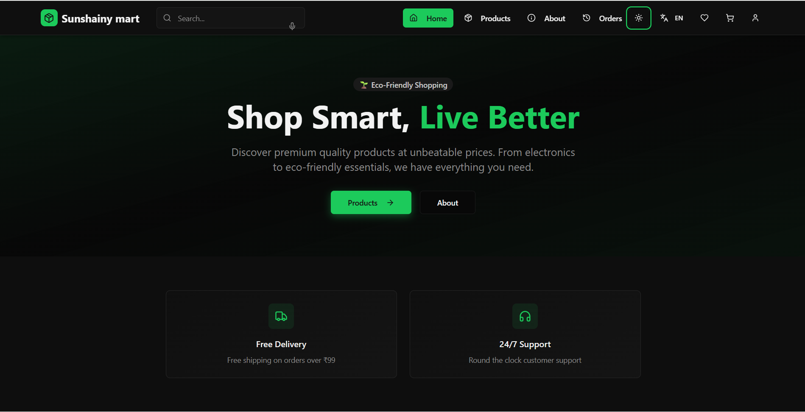
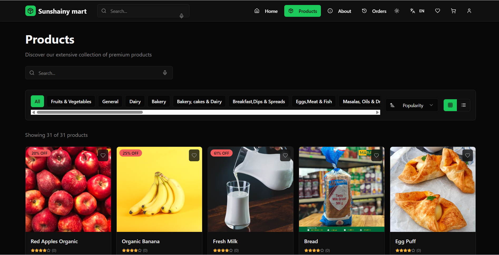
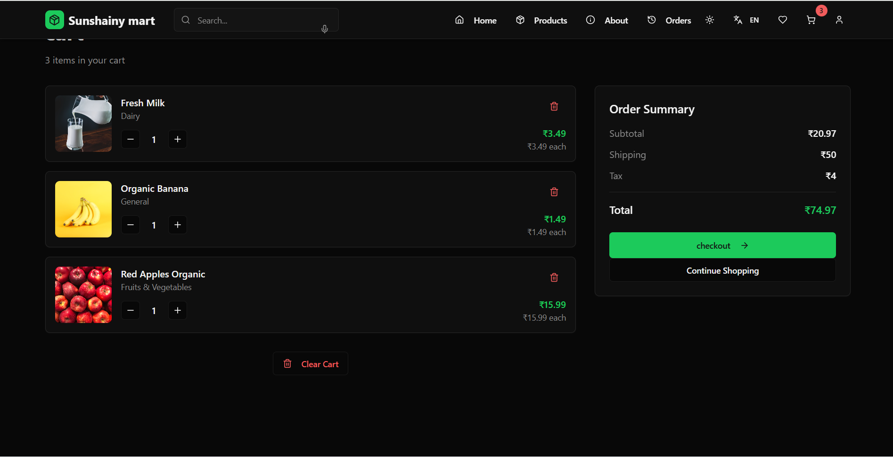
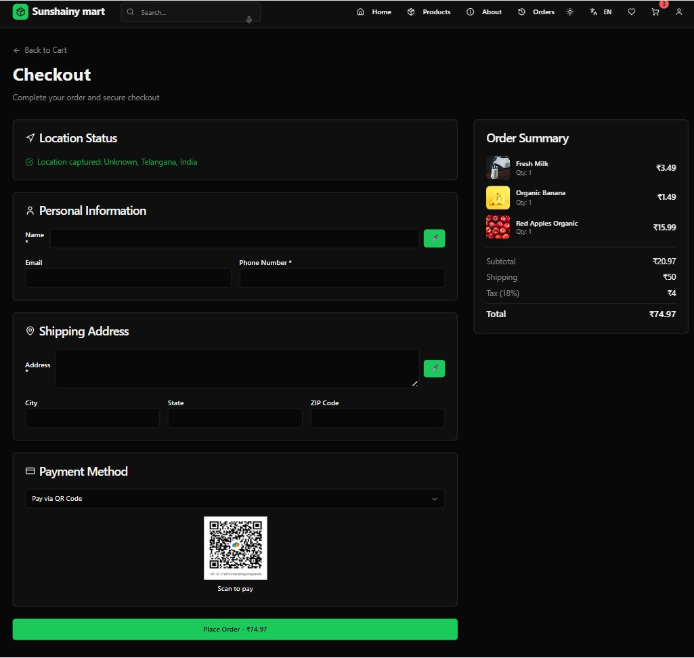
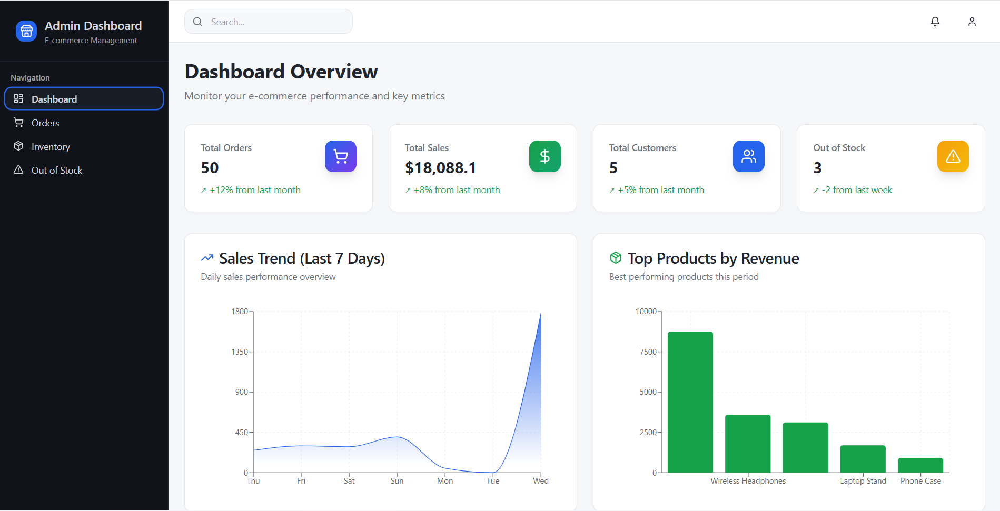

# SS Supermarket – Cloud-Native Retail Platform

Built under the auspices of PREXURA Labs — engineered for resilience, velocity, and operability at scale.

A production-ready, cloud-friendly monorepo powering a modern supermarket experience. It comprises a high-performance customer-facing storefront (Vite + React + TypeScript), an operational admin dashboard, and a Node.js/Express backend backed by MongoDB. The system is optimized for rapid iteration, observability, and scalable deployment.

---

## At a glance
- **Frontend (Storefront)**: `frontend/` — Vite, React 18, TypeScript, TailwindCSS, shadcn/ui, Radix UI, React Router, React Query
- **Admin Dashboard**: `admin_dashboard/` — Vite, React 18, TypeScript, TailwindCSS, shadcn/ui
- **Backend (API)**: `backend/` — Node.js, Express, MongoDB (Mongoose)
- **Dev UX**: Fast HMR, typed APIs, modular UI, ergonomic hooks, opinionated linting
- **Infra-ready**: .env-driven, CORS-enabled, health endpoints, portable start scripts

---

## Badges


---

## Repository structure

```
SS_Supermarket/
├─ frontend/           # Customer-facing PWA
├─ admin_dashboard/    # Back-office dashboard
├─ backend/            # REST API (Express + MongoDB)
├─ scripts/            # Local utilities & diagnostics
└─ README.md
```

---

## Quickstart

- Prerequisites: Node.js >= 18, npm or bun, MongoDB Atlas (or local MongoDB), Telegram bot (optional)
- Clone and install:

```bash
# root
npm -v

# frontend
cd frontend && npm install && cd ..

# admin dashboard
cd admin_dashboard && npm install && cd ..

# backend
cd backend && npm install && cd ..
```

- Environment variables: create `.env` files as described below.

- Run all services (in separate terminals):

```bash
# backend
cd backend && npm run start

# frontend
cd frontend && npm run dev

# admin dashboard
cd admin_dashboard && npm run dev
```

Default ports:
- API: `http://localhost:5000`
- Frontend: `http://localhost:5173`
- Admin: `http://localhost:5173` (or next available if frontend uses 5173)

---

## Environment configuration

### Backend (`backend/.env`)

```bash
MONGO_URI=mongodb+srv://<user>:<password>@<cluster>/<db>?retryWrites=true&w=majority
JWT_SECRET=<long_random_secret>
# Optional Telegram notifications for orders
TELEGRAM_BOT_TOKEN=<bot_token>
TELEGRAM_CHAT_ID=<chat_id>
```

- The backend exposes a health check at `/api/health` and a diagnostic route at `/__server_version`.
- CORS is enabled for local development.

### Frontend (`frontend/.env`)

```bash
# API base overrides the default http://localhost:5000
VITE_API_URL=http://localhost:5000
```

- The storefront consumes the API base via `src/lib/apiBase.ts`.

### Admin Dashboard (`admin_dashboard/.env`)

```bash
# If admin dashboard calls the same API
VITE_API_URL=http://localhost:5000
```

---

## Core capabilities

- **Product catalog**: CRUD endpoints with granular PATCH/PUT in the API
- **Cart & checkout**: Client-side cart, order placement to API
- **Authentication**: Token (JWT) based sessions for customer endpoints
- **Observability**: Health endpoint, version diagnostic, ergonomic server logs
- **Analytics**: Out-of-stock search tracking and aggregation endpoints
- **Notifications**: Optional Telegram bot integration on order creation

---

## API surface (selected)

Base URL: `http://localhost:5000`

- `GET /api/health` — service liveness probe
- `GET /__server_version` — server PID and file mtime
- Products
  - `GET /api/products` — list products
  - `GET /api/products/:id` — get product
  - `POST /api/products` — create product
  - `PATCH /api/products/:id` — partial update
  - `PUT /api/products/:id` — full update
  - `DELETE /api/products/:id` — delete product
- Orders
  - `POST /api/orders` — create order (triggers Telegram if configured)
  - `GET /api/orders` — list orders (admin/debug)
  - `PUT /api/orders/:id` — update order (status/address/location)
- Customers
  - `POST /api/customers` — register
  - `POST /api/login` — login → `{ token }`
  - `GET /api/me` — verify token
  - `GET /api/customers/:id/orders` — recent orders for customer
  - `GET /api/customers/lookup?phone=...&name=...` — autofill lookup
- Out-of-Stock Analytics
  - `POST /api/out-of-stock` — track search
  - `GET /api/out-of-stock` — list searches (admin)
  - `GET /api/out-of-stock/analytics?days=30` — top searches window

> Notes
> - The sample implementation stores customer passwords in plaintext (demo). For production, switch to bcrypt or Argon2 and enforce transport-layer security.

---

## Frontend & Admin feature highlights

- **UX primitives**: shadcn/ui + Radix UI components, adaptive themes, keyboard-first UX
- **Performance**: Vite HMR, code-splitting, memoized selectors, React Query caching
- **DX**: Type-safe forms with React Hook Form + Zod, composable hooks, modular components

---

## Development scripts

```bash
# Frontend / Admin (Vite)
npm run dev       # dev server with HMR
npm run build     # production build
npm run preview   # preview built assets
npm run lint      # static analysis

# Backend (Express)
npm run start     # start API
npm run dev       # nodemon (if configured)
```

---

## Screenshots

Screenshots are maintained in the repository-level `screenshots/` directory. Suggested canonical filenames are provided below; adjust as needed to match your asset names.

```markdown





```

Tip: For retina-quality visuals, prefer 1440×900 or 1920×1080 PNGs. Include both light and dark variants when applicable.

---

## Deployment notes

- Frontend/Admin: Static assets via any CDN or Vercel/Netlify. Configure `VITE_API_URL` per environment.
- Backend: Deploy to any Node-compatible runtime (Render, Railway, Fly.io, Docker/K8s). Provide `MONGO_URI`, `JWT_SECRET`, and optional Telegram secrets.
- Security hardening: Rate limiting, CSRF for mutating browser calls, secure cookies, input validation, and hashed passwords are recommended for production.

---

## Contributing

- Commit messages: Conventional Commits are encouraged.
- Code quality: ESLint + TypeScript across apps.
- PRs: Please include before/after screenshots for UI changes.

---

## License

Proprietary © PREXURA Labs. All rights reserved.


